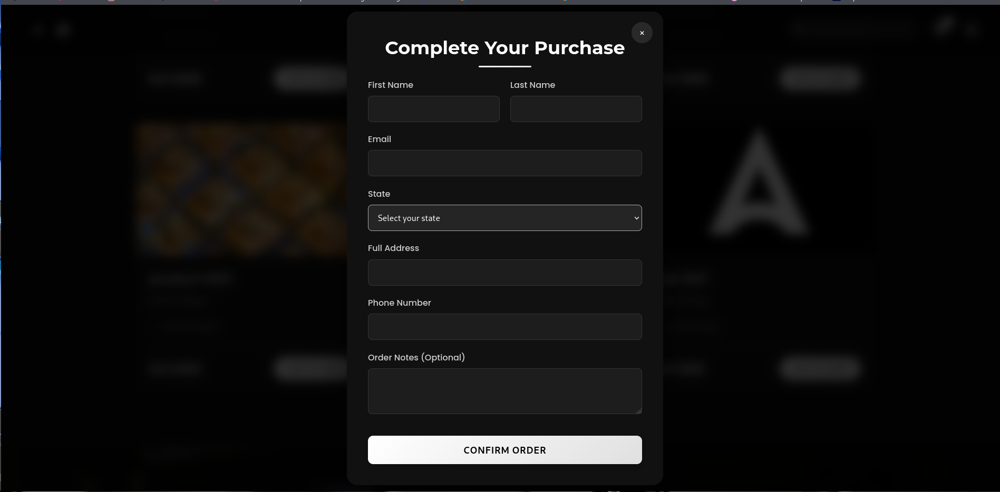

# 🛍️ Ashref Online Store 🚀

🌐 [https://ashref.onrender.com](https://ashref.onrender.com)

---

## 🌟 A Fresh & Youthful Shopping Experience

**Ashref Online Store** is a modern e-commerce platform designed with a clean, stylish, and user-friendly interface. Perfect for young and trendy shoppers who want a seamless online shopping experience.

---

## ✅ Features

- **Modern & Sleek Interface**  
  Intuitive layout with sharp visuals and elegant design.

- **Diverse & Organized Product Selection**  
  Products categorized for easy browsing (electronics, fashion, accessories, etc.).

- **Smart & Fast Search**  
  Responsive search bar with instant suggestions.

- **High-Quality Visuals**  
  Clear and detailed product images to boost buyer confidence.

- **Smooth Checkout Process**  
  Simple cart and payment flow for hassle-free purchasing.

- **Fully Mobile Responsive**  
  Optimized for all devices: phones, tablets, and desktops.

- **Secure & Trustworthy**  
  HTTPS and secure data handling ensure user safety.

- **Youthful Vibe & Energetic Style**  
  Fresh colors, modern fonts, and dynamic icons.

- **Fast Performance**  
  Optimized code and quick load times for seamless experience.

---

## 🚀 Potential Features to Add

- Customer Reviews & Testimonials  
- Best Sellers or Trending Products sections  
- Live Chat or Quick Support  
- Blog or Tips Section for SEO and added value

---

## 📁 Project Structure

```
Ashref-Online-Store/
├── app.py
├── orders.json
├── payments.json
├── products.json
├── settings.json
├── users.json
├── requirements.txt
├── project/
├── project-bolt-sb1-u5ynrkvy.zip
├── myenv/
├── static/
│   ├── images/
│   │   └── A.png
│   ├── videos/
│   │   ├── hero.mp4
│   │   └── footer.mp4
│   └── uploads/
├── templates/
│   ├── admin/
│   │   ├── dashboard.html
│   │   └── login.html
│   ├── add_product.html
│   ├── edit_product.html
│   ├── index.html
│   ├── orders.html
│   ├── payment_cancelled.html
│   ├── payment_failed.html
│   ├── payment_succes.html
│   ├── products.html
│   ├── setting.html
│   └── view_orders.html
```

---

## 🖼️ Screenshots

### 🏠 Home Page


### 🛒 Product Page


### 🧾 Checkout Page


### 🧺 Product Card


### 🧑‍💻 Dashboard Overview


### 📝 Form Filling Example


### 🔐 Login Page


### 📦 Product View in Admin Dashboard


---

*Thank you for checking out Ashref Online Store! 🙌*
